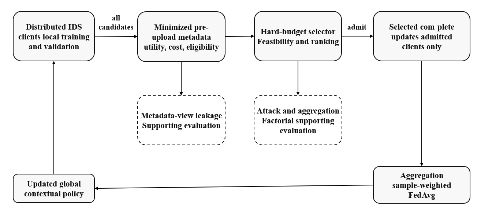

# CB-FedSelect manuscript-alignment record v1.1.1

This documentation-only alignment records the final pre-submission manuscript presentation update.

## Changes

- Replaced manuscript Figure 1 with the finalized CB-FedSelect workflow diagram.
- Normalized LaTeX float placement to remove large unintended blank regions around tables, algorithms, and figures.
- Produced a clean JISA submission package without internal workflow/version marks.

## Scientific boundary

- No experimental cell was rerun.
- No dataset, seed, split, model, selector, threshold, coefficient, metric, hypothesis, or statistical decision was changed.
- The primary reproducibility artifact v1.0.0 and targeted-validity artifact v1.1.0 remain immutable.
- This update documents manuscript presentation only and introduces no new scientific evidence.

## Final workflow figure

